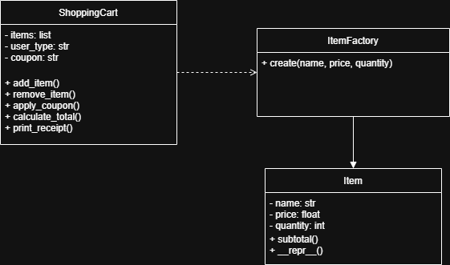
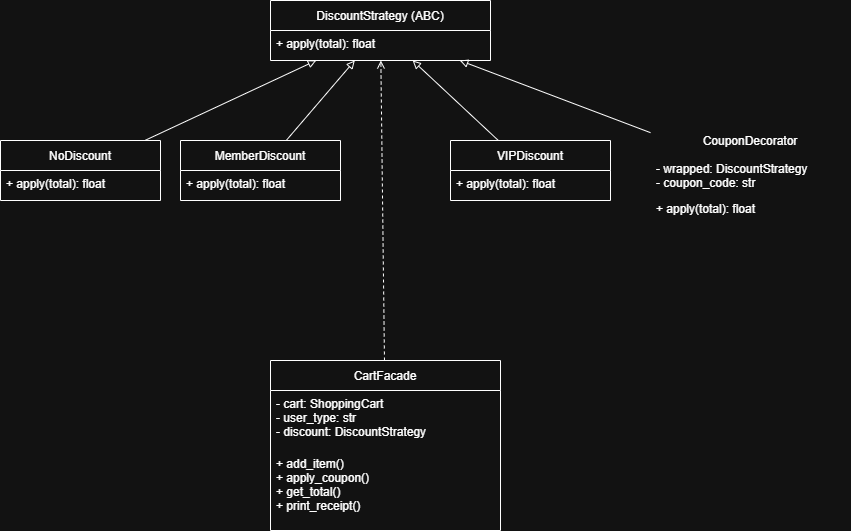

# 🛒 Evolving Cart — Software Design Patterns Assignment

**Topic:** D — E-Commerce Shopping Cart  
**Student:** Yesha1728  
**Course:** Software Design Patterns — 2025-2026

---

## 📌 What This Project Does

This project simulates an e-commerce shopping cart system that evolves
through three phases, each applying real software design patterns to fix
real problems in the codebase.

It starts as messy, hard-to-maintain code and gradually becomes a clean,
extensible, well-structured system.

---

## 🏗️ Design Patterns Used

### Phase 1 — Creational
| Pattern | Where | Why |
|---|---|---|
| Factory Method | `src/item.py` | Centralize item creation with validation |

### Phase 2 — Structural
| Pattern | Where | Why |
|---|---|---|
| Decorator | `src/discount.py` | Layer discounts without modifying existing code |
| Facade | `src/cart_facade.py` | Hide system complexity behind one simple interface |

### Phase 3 — Behavioral
| Pattern | Where | Why |
|---|---|---|
| Observer | `src/observer.py` | Notify listeners when cart changes |
| Strategy | `src/discount.py` | Swappable discount algorithms at runtime |

---

## 📁 Project Structure

- README.md
- PATTERNS.md
- PROBLEMS.md
- src/
  - cart.py
  - item.py
  - discount.py
  - cart_facade.py
  - observer.py
- docs/
  - diagrams/
  - ai-log/
    - phase1.md
    - phase2.md
    - phase3.md
- .github/workflows/ci.yml
---

## 🚀 How to Run

Make sure Python 3.x is installed, then run:

```bash
cd src
python cart_facade.py
```

Expected output:
```
[LOG] Event: item_added | Data: {'name': 'Laptop', 'price': 999.99, 'quantity': 1}
[STOCK] Reserving stock for: Laptop x1
[LOG] Event: item_added | Data: {'name': 'Mouse', 'price': 29.99, 'quantity': 2}
[STOCK] Reserving stock for: Mouse x2
[LOG] Event: coupon_applied | Data: {'code': 'SAVE10'}
===== RECEIPT =====
Laptop x1 - $999.99
Mouse x2 - $59.98
User type: vip
Coupon: SAVE10
TOTAL: $837.98
===================
```

## 🏛️ Architecture Diagram


__________________________________________________


---

## 🤖 AI Usage

## 🤖 AI Usage

AI tools (Claude) were used for:
- Code review and design pattern discussion (Phase 1)
- Pattern selection advice — Adapter vs Facade (Phase 2)
- 30+ minute pair programming session (Phase 3)

All AI interactions are logged in docs/ai-log/.
All code was written and understood by the student — no direct copying.